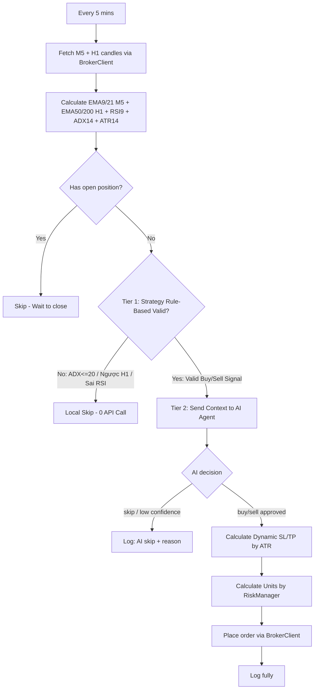

# ARCHITECTURE.md — TradeBot_XAU

**Version**: v2.0
**Date**: 2026-09-01

---

## 1. Tech Stack

| Component | Technology | Reason |
|---|---|---|
| Runtime | Node.js (Bot & Chart Server), Python (MT5 Bridge) | Simple I/O-bound bot, robust MT5 integration via official Python library |
| Broker API | MT5 Python FastAPI Bridge (Local) | Reliable local bridge connecting directly to MetaTrader 5 terminal |
| Web Dashboard | HTML/JS/CSS + Lightweight Charts | Real-time monitoring, strategy KPIs, and infinite historical scrolling |
| AI Engine | **Pluggable** via `AIAgentFactory` — default: Qwen (Alibaba DashScope); alternative: Google Gemini. Switch by setting `AI_PROVIDER` in `.env`. | Final decision making based on technical context |
| Indicators | `technicalindicators` (npm) | Reusable, verified, avoids rewriting MA/RSI/ATR |
| HTTP client | `axios` | Call Broker API + AI Provider API |
| Config | `dotenv` | Secure API keys, separate config from code |
| Backtest Storage | `better-sqlite3` | Lightweight, no separate DB server needed |

## 2. Directory Structure

```
TradeBot_XAU/
├── .env                        ← API keys — DO NOT commit to git
├── .env.example                ← Template (no real values) — safe to commit
├── .gitignore
├── package.json
├── README.md
│
├── src/
│   ├── config.js                ← Load .env, export global config
│   │
│   ├── data/
│   │   ├── BrokerClient.js    ← Wrapper to call Broker REST API (Phase 3 & 4: Paper/Live)
│   │   └── CsvDataClient.js    ← Read local candle CSV file (Phase 1 & 2: Test/Backtest)
│   │
│   ├── indicators/
│   │   ├── MA.js                ← SMA/EMA
│   │   ├── RSI.js                ← RSI + OB/OS zones
│   │   └── ATR.js                ← ATR (used for dynamic SL)
│   │
│   ├── ai/
│   │   ├── BaseAIAgent.js       ← Abstract base: shared prompt template, JSON validation, skip fallback
│   │   ├── AIAgentFactory.js    ← Factory: creates agent based on AI_PROVIDER in .env
│   │   ├── QwenAgent.js         ← Alibaba Cloud DashScope (Qwen) — default provider
│   │   ├── GeminiAgent.js       ← Google Gemini — alternative provider
│   │   └── promptTemplate.js    ← Centralized prompt template (shared by all agents)
│   │
│   ├── bot/
│   │   ├── SignalBuilder.js      ← Aggregate indicators → context for AI agent
│   │   ├── TradingBot.js         ← Main logic: candles → signal → AI → order
│   │   └── RiskManager.js        ← Calculate units based on risk %
│   │
│   ├── backtest/
│   │   ├── BacktestEngine.js     ← Simulate trading on historical data
│   │   └── ReportGenerator.js    ← Calculate metrics & export report
│   │
│   └── utils/
│       └── logger.js             ← Log to file + console
│
├── data/
│   └── candles.csv             ← source-agnostic historical candle data (for backtest)
│
├── logs/
│   └── trade_log.jsonl           ← Log every decision (including "skip")
│
├── tests/
│   └── *.test.js               ← Jest unit tests
│
└── scripts/
    ├── run_live.js                ← Entry point: run real/demo bot
    ├── run_backtest.js            ← Entry point: run backtest
    ├── mt5_bridge/                ← Python FastAPI connecting to local MT5
    └── chart_viewer/              ← Web dashboard (Node.js server + HTML/JS UI)
```

## 3. Layered Architecture

### Layer 1 — Data Layer (`src/data/`)

Two separate clients with an **identical interface** — swap by injecting the appropriate client:

#### `CsvDataClient.js` — used in Phase 1 (unit test) & Phase 2 (backtest)
Reads a local CSV file exported from any broker platform (e.g. MT5, TradingView, Dukascopy). No network calls, no API key required.
- Source file: `data/candles.csv` (path set via `CSV_DATA_PATH` in `.env`)
- `getCandles(count, endTime?)` — returns last N candles up to a given timestamp (enables time-window simulation in backtest)
- `getAccountBalance()`, `createOrder()`, `getOpenPositions()`, `closePosition()` — all **mocked** (log to console, return fake IDs)

#### `BrokerClient.js` — used in Phase 3 (Paper Trading) & Phase 4 (Live Trading)
Communicates with the local **MT5 Python FastAPI Bridge** (default port `8000`) or a generic Broker REST API.
- `getCandles(count, granularity)` — Fetch last N candles from broker/bridge
- `getAccountBalance()` — Get real account balance
- `createOrder(side, units, sl, tp)` — Place Market order with SL/TP
- `getOpenPositions()` — Check open positions
- `closePosition()` — Close position

Endpoint details: see `API-CONTRACTS.md`.

### Layer 2 — Indicator Layer (`src/indicators/`)

Pure functions, no side-effects, easy to unit test independently:

- `MA.js`: `calculateSMA()`, `calculateEMA()`, `getCrossSignal()`
- `RSI.js`: `calculate()`, `getZone()`
- `ATR.js`: `calculate()`

Default period/threshold parameters are taken from `STRATEGY.md`, not hardcoded in indicator files.

### Layer 3 — AI Decision Layer (`src/ai/`) ⭐ Core

Pluggable multi-provider AI layer. `AIAgentFactory.createAgent()` reads `AI_PROVIDER` from `.env` and returns the appropriate agent instance. All agents extend `BaseAIAgent` and share the same interface and safety behavior.

**Files**:
- `BaseAIAgent.js` — shared prompt template, JSON validation, skip fallback logic
- `AIAgentFactory.js` — factory: resolves `AI_PROVIDER` → instantiates `QwenAgent` or `GeminiAgent`
- `QwenAgent.js` — calls Alibaba Cloud DashScope (OpenAI-compatible endpoint)
- `GeminiAgent.js` — calls Google Gemini API
- `promptTemplate.js` — centralized prompt, shared by all providers (read from here, not hardcoded in agent)

**Adding a new AI provider**: create `src/ai/NewProviderAgent.js` extending `BaseAIAgent`, override `getDecision()`, register in `AIAgentFactory`.

Mandatory safety principles (detailed in `PROJECT-RULES.md`):
- `confidence < MIN_CONFIDENCE` → `skip`
- JSON parse error → log warning, `skip`
- API timeout → `skip`, never trade blind

Input/output schema: see `DATA-SCHEMA.md`. Prompt template and response contracts: see `API-CONTRACTS.md` and `STRATEGY.md`.

### Layer 4 — Bot Logic (`src/bot/`)

- **SignalBuilder.js**: aggregates all indicators into 1 context object to send to the AI agent.
- **RiskManager.js**: `calculateUnits(balance, riskPercent, sl_distance, price)` → number of units, enforces maximum risk per trade.
- **TradingBot.js**: main loop (every 5 minutes) using **2-Tier Decision Architecture**:
  1. Fetch latest M5 candles (+ H1 candles for MTF trend filter)
  2. Calculate EMA9/21 (M5), EMA50/200 (H1), RSI9, ADX14, ATR14
  3. Check open positions → if exists, skip
  4. **Tier 1 (Strategy Hard Filters)**: Check H1 Trend + M5 EMA Cross + RSI Zone + ADX > 20. If not satisfied, skip immediately (0 API calls).
  5. **Tier 2 (AI Decision Layer)**: If Tier 1 triggers a candidate Buy/Sell signal, send context to AI Agent (via `AIAgentFactory.createAgent()`) to validate candle structure, filter chop/wicks, and refine SL/TP.
  6. Receive AI decision: if confidence reaches threshold, calculate SL/TP by ATR, calculate units via RiskManager, place order.
  7. Log fully (including skip).

### Layer 5 — Backtest Engine (`src/backtest/`)

- **BacktestEngine.js**: simulation on historical candle data loaded from `CsvDataClient`, 2 modes:
  - *Rule-based*: uses hard rules (EMA cross + RSI + ADX threshold) for fast testing, consumes no AI quota.
  - *AI-simulated*: calls AI agent **only on valid Rule-Based Strategy signals** to validate prompt quality without wasting quota on invalid crosses.
  - Data source: `CsvDataClient.getCandles()` — iterates through the CSV window-by-window to simulate real-time candle flow.
- **ReportGenerator.js**: calculates Win Rate, Profit Factor, Net Profit, Max Drawdown, Sharpe Ratio; exports `backtest_result.json` + prints to console.

### Layer 6 — Utils (`src/utils/logger.js`)

Consistent logging to both file and console, shared across all layers.

## 4. Overall Workflow



## 5. Design Principles

- **Separate parameters from architecture**: MA period, RSI threshold, prompt template... are defined in `STRATEGY.md`, not located in this architecture file. When optimizing strategy, no need to touch `ARCHITECTURE.md`.
- **Each module independent, easy to test separately**: indicators are pure functions; `BrokerClient` and AI agents can be mocked when testing `TradingBot`.
- **Backtest does not depend on real AI API calls** unless actively enabling AI-simulated mode — helps iterate quickly during strategy optimization.
- **AI provider is hot-swappable**: set `AI_PROVIDER=qwen` or `AI_PROVIDER=gemini` in `.env` — no code changes required. Adding a new provider only requires a new `*Agent.js` file + one line in `AIAgentFactory`.

## 6. Verification Plan

### Phase 1 — Manual Unit Test
- Run each indicator with real candle data, compare EMA/RSI/ADX/ATR with TradingView.
- Test each AI agent (`QwenAgent`, `GeminiAgent`) with mock context, check correct JSON schema parsing.
- Test `AIAgentFactory` to confirm correct provider routing based on `AI_PROVIDER` config.

### Phase 2 — Backtest
- `node scripts/run_backtest.js` — reads data from `data/candles.csv` via `CsvDataClient` (no broker API needed).
- Covers the full CSV date range (~1 year of M5 candles).
- Compare Win Rate and Net Profit with the same strategy on TradingView Pine Script.

### Phase 3 — Paper Trading (Broker Demo account)
- Configure `BROKER_BASE_URL`, `BROKER_API_KEY`, `BROKER_ACCOUNT_ID` in `.env` to point to a real broker's **Demo** endpoint.
- `node scripts/run_live.js` with `BrokerClient` as the data source.
- Monitor logs for 24-48h, check if SL/TP are placed correctly.

### Phase 4 — Live Trading
- Change `BROKER_BASE_URL` in `.env` to the broker's **Live** endpoint.
- Only switch to live after Demo runs stably for ≥ 1 week (per `PROJECT-RULES.md`).

## 7. Future Extension Points (out of current scope)

- Multi-symbol / multi-timeframe
- Switch from SQLite to another DB if backtest data volume becomes much larger
- Adding a new AI provider: implement `src/ai/NewProviderAgent.js` extending `BaseAIAgent`, add a new case in `AIAgentFactory.createAgent()`, add the corresponding API key/model vars to `.env` and `DATA-SCHEMA.md §1`.
