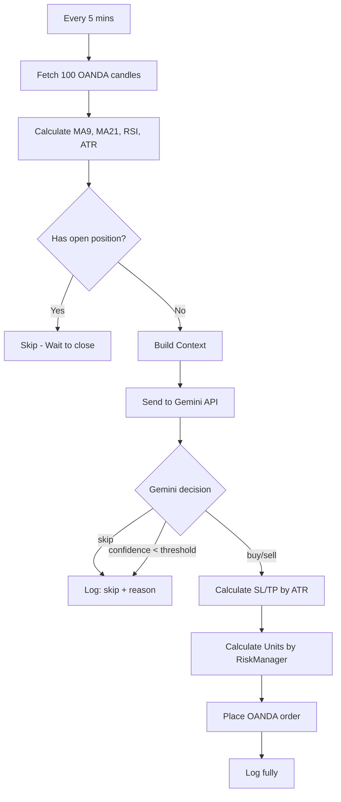

# ARCHITECTURE.md — TradeBot_XAU_Gemini

**Version**: v1.0
**Date**: 2026-08-29

---

## 1. Tech Stack

| Component | Technology | Reason |
|---|---|---|
| Runtime | Node.js | Simple, suitable for I/O-bound (continuous API calls) |
| Broker API | OANDA REST API v3 | Free, has Demo account, supports XAU/USD historical candles |
| AI Engine | Google Gemini API | Final decision making based on technical context |
| Indicators | `technicalindicators` (npm) | Reusable, verified, avoids rewriting MA/RSI/ATR |
| HTTP client | `axios` | Call OANDA + Gemini API |
| Config | `dotenv` | Secure API keys, separate config from code |
| Backtest Storage | `better-sqlite3` | Lightweight, no separate DB server needed |

## 2. Directory Structure

```
TradeBot_XAU_Gemini/
├── .env                        ← API keys — DO NOT commit to git
├── .gitignore
├── package.json
├── README.md
│
├── src/
│   ├── config.js                ← Load .env, export global config
│   │
│   ├── data/
│   │   └── OandaClient.js       ← Wrapper to call OANDA REST API
│   │
│   ├── indicators/
│   │   ├── MA.js                ← SMA/EMA
│   │   ├── RSI.js                ← RSI + OB/OS zones
│   │   └── ATR.js                ← ATR (used for dynamic SL)
│   │
│   ├── ai/
│   │   └── GeminiAgent.js        ← Call Gemini, build prompt, parse response
│   │
│   ├── bot/
│   │   ├── SignalBuilder.js      ← Aggregate indicators → context for Gemini
│   │   ├── TradingBot.js         ← Main logic: candles → signal → AI → order
│   │   └── RiskManager.js        ← Calculate units based on risk %
│   │
│   ├── backtest/
│   │   ├── BacktestEngine.js     ← Simulate trading on historical data
│   │   └── ReportGenerator.js    ← Calculate metrics & export report
│   │
│   └── utils/
│       └── logger.js             ← Log to file + console
│
├── logs/
│   └── trade_log.jsonl           ← Log every decision (including "skip")
│
└── scripts/
    ├── run_live.js                ← Entry point: run real/demo bot
    └── run_backtest.js            ← Entry point: run backtest
```

## 3. Layered Architecture

### Layer 1 — Data Layer (`src/data/OandaClient.js`)

Only responsible for communicating with OANDA API, contains no business logic.

- `getCandles(count, granularity)` — Fetch last N candles
- `getAccountBalance()` — Get account balance
- `createOrder(side, units, sl, tp)` — Place Market order with SL/TP
- `getOpenPositions()` — Check open positions
- `closePosition()` — Close position

Endpoint details: see `API-CONTRACTS.md`.

### Layer 2 — Indicator Layer (`src/indicators/`)

Pure functions, no side-effects, easy to unit test independently:

- `MA.js`: `calculateSMA()`, `calculateEMA()`, `getCrossSignal()`
- `RSI.js`: `calculate()`, `getZone()`
- `ATR.js`: `calculate()`

Default period/threshold parameters are taken from `STRATEGY.md`, not hardcoded in indicator files.

### Layer 3 — AI Decision Layer (`src/ai/GeminiAgent.js`) ⭐ Core

Receives context from `SignalBuilder`, calls Gemini API, returns validated decision.

Mandatory safety principles (detailed in `PROJECT-RULES.md`):
- `confidence < MIN_CONFIDENCE` → `skip`
- JSON parse error → log warning, `skip`
- API timeout → `skip`, never trade blind

Input/output schema: see `DATA-SCHEMA.md`. Prompt template and response contracts: see `API-CONTRACTS.md` and `STRATEGY.md`.

### Layer 4 — Bot Logic (`src/bot/`)

- **SignalBuilder.js**: aggregates all indicators into 1 context object to send to Gemini.
- **RiskManager.js**: `calculateUnits(balance, riskPercent, sl_distance, price)` → number of units, enforces maximum risk per trade.
- **TradingBot.js**: main loop (every 5 minutes):
  1. Fetch latest 100 M5 candles
  2. Calculate MA9, MA21, RSI, ATR
  3. Check open positions → if exists, skip
  4. Build context → send to GeminiAgent
  5. Receive decision
  6. If buy/sell and confidence reaches threshold: calculate SL/TP by ATR, calculate units via RiskManager, place order
  7. Log fully (including skip)

### Layer 5 — Backtest Engine (`src/backtest/`)

- **BacktestEngine.js**: simulation on historical data, 2 modes:
  - *Rule-based*: uses hard rules (MA cross + RSI threshold) for fast testing, consumes no Gemini quota.
  - *AI-simulated*: actual Gemini calls, used when needing to check prompt quality.
- **ReportGenerator.js**: calculates Win Rate, Profit Factor, Net Profit, Max Drawdown, Sharpe Ratio; exports `backtest_result.json` + prints to console.

### Layer 6 — Utils (`src/utils/logger.js`)

Consistent logging to both file and console, shared across all layers.

## 4. Overall Workflow



## 5. Design Principles

- **Separate parameters from architecture**: MA period, RSI threshold, prompt template... are defined in `STRATEGY.md`, not located in this architecture file. When optimizing strategy, no need to touch `ARCHITECTURE.md`.
- **Each module independent, easy to test separately**: indicators are pure functions; `OandaClient` and `GeminiAgent` can be mocked when testing `TradingBot`.
- **Backtest does not depend on real Gemini** unless actively enabling AI-simulated mode — helps iterate quickly during strategy optimization.

## 6. Verification Plan

### Phase 1 — Manual Unit Test
- Run each indicator with real candle data, compare MA/RSI/ATR with TradingView.
- Test `GeminiAgent` with mock context, check correct JSON schema parsing.

### Phase 2 — Backtest
- `node scripts/run_backtest.js` with 6 months of XAU/USD data.
- Compare Win Rate and Net Profit with the same strategy on TradingView Pine Script.

### Phase 3 — Paper Trading (OANDA Demo)
- `node scripts/run_live.js` with Demo account.
- Monitor logs for 24-48h, check if SL/TP are placed correctly.

### Phase 4 — Live Trading
- Only switch to live after Demo runs stably for ≥ 1 week (per `PROJECT-RULES.md`).

## 7. Future Extension Points (out of current scope)

- Multi-symbol / multi-timeframe
- Real-time monitoring dashboard (if implemented, `UI-DESIGN.md` needs to be added)
- Switch from SQLite to another DB if backtest data volume becomes much larger
